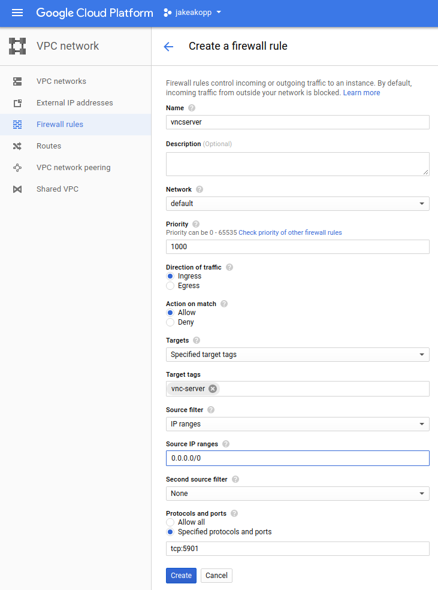

# Running MAE on GCP

This document describes how to use a VM on GCP to run the MAE annotation tool.

## Setting up firewall rules

Set up firewall rules so you'll be able to access your VM once you set it up.
Equivalent methods for doing this via the browser or command line are provided
below.

### Via Google Cloud Console UI

1. On Google Cloud Console navigate to VPC Network -> Firewall Rules and select
   "Create Firewall Rule" ([direct link](https://console.cloud.google.com/networking/firewalls/add)).
1. Set the following fields.
  * Name: vnc-server
  * Target Tags: vnc-server
  * Source IP Ranges: 0.0.0.0/0
  * Protocols and ports: tcp:5901
1. Click "create".



### Via Command-line

```shell
PROJECT=my-gcp-project
gcloud compute --project=${PROJECT?} firewall-rules create vnc-serve \
--direction=INGRESS --priority=1000 --network=default --action=ALLOW \
--rules=tcp:5901 --source-ranges=0.0.0.0/0 --target-tags=vnc-server
```

## Creating a VM

1. On Google Cloud Console navigate to Compute Engine -> VM Instances and select
   "Create Instance" ([direct link](https://console.cloud.google.com/compute/instancesAdd)).
1. Give it a name, e.g. mae-vncserver.
1. Check "Container (Deploy a container image to this VM instance.)".
1. Set "Container image" to `gcr.io/jakeakopp-953/mae:latest`.
1. Click "Advanced container options", then check "Run as privileged".
1. (optional) Set a password:
  * add an environment variable called PASSWORD. The value will be the password
    you use to connect to the server. If you skip this step, the password is
    simply "password".
1. Add a `vnc-server` network tag:
  1. Click "Management, disks, networking, SSH keys" to reveal more options.
  1. Select the "Networking" tab.
  1. Add the network tag `vnc-server`, to match the one set in the firewall rule
     created above.
1. Click the "Create" button at the bottom.

## Connecting

1. Get the IP address of your VM. This will be listed on the [VM instances page](https://console.cloud.google.com/compute/instances).
1. Install a VNC client, e.g. [VNC Viewer for Chrome](https://chrome.google.com/webstore/detail/vnc%C2%AE-viewer-for-google-ch/iabmpiboiopbgfabjmgeedhcmjenhbla?hl=en).
1. User your VNC client to connect to IP_ADDRESS:5901 (e.g. 104.198.72.4:5901).
1. Password is `password`, unless you set one up in "Creating a VM" above.
1. If you wish to change the VNC password, run `vncpasswd` in a terminal (
   Applications -> System Tools -> XTerm).
1. Double-click on MAE (i.e. mae-2.0.9-fatjar.jar) to start.
1. If you have notes on Google Cloud Storage, you can download them to the VM
   using gsutil in a terminal, e.g.:
```shell
mkdir -p /home/notes/
gsutil cp gs://my-bucket/notes/* /home/notes/
```

## Creating a new docker image

If you wish to create your own docker image, you can do so using the following
commands:

```
PROJECT=my-gcp-project
cd mae/
docker build -t mae .
docker tag mae gcr.io/${PROJECT?}/mae:latest
gcloud docker -- push gcr.io/${PROJECT?}/mae:latest
```

# Tools for working with MAE and BigQuery

We have several tools to facilitate working with MAE. To use the tools below,
first download the code from GitHub, e.g.:

```shell
git clone https://github.com/GoogleCloudPlatform/healthcare-deid.git && \
cd healthcare-deid
```

## Downloading notes from BigQuery

You can use bq_to_xml.py to download notes from a BigQuery table and save them
to local disk in XML format so they can be read by MAE.

First install the Google BigQuery Python client:

```shell
virtualenv env
source env/bin/activate
pip install google-cloud-bigquery
```

Then run the tool, e.g.:

```shell
python mae/bq_to_xml.py \
  --input_query="SELECT patient_id,record_number,note FROM [${PROJECT:?}:${DATASET:?}.${TABLE:?}]" \
  --local_output_dir=output/directory/
```

## Removing invalid characters from text files

If you discover that your input files cannot be opened by MAE due to invalid
XML characters, you can use the "remove_invalid_characters" tool.

Run either with [bazel](http://bazel.build/versions/master/docs/install.html):

```shell
bazel build mae:remove_invalid_characters && \
bazel-bin/mae/remove_invalid_characters --input_pattern="dir/*.xml" --output_dir="output/"
```

Or without bazel:

```shell
PYTHONPATH="."
python mae/remove_invalid_characters.py --input_pattern="dir/*.xml"  --output_dir="output/"
```

## Uploading XML files to BigQuery

upload_files_to_bq.py can upload your XML files to BigQuery either from local
disk or from GCS.

Install the apache beam client. Note that google-cloud-storage is also required
if the files are coming from GCS, and at least version 0.5.23 of google-apitools if the files contain unicode characters.

```shell
virtualenv env
source env/bin/activate
pip install apache_beam[gcp] google-cloud-storage google-apitools>=0.5.23
```

The tool can be built and run using the [bazel build system](http://bazel.build/versions/master/docs/install.html):

```shell
bazel build mae:upload_files_to_bq && bazel-bin/mae/upload_files_to_bq \
  --file_pattern="dir/*.xml" --table_name project:dataset.table
```

Or without bazel:

```shell
PYTHONPATH="."
python mae/upload_files_to_bq.py --file_pattern="dir/*.xml" --table_name project:dataset.table
```
